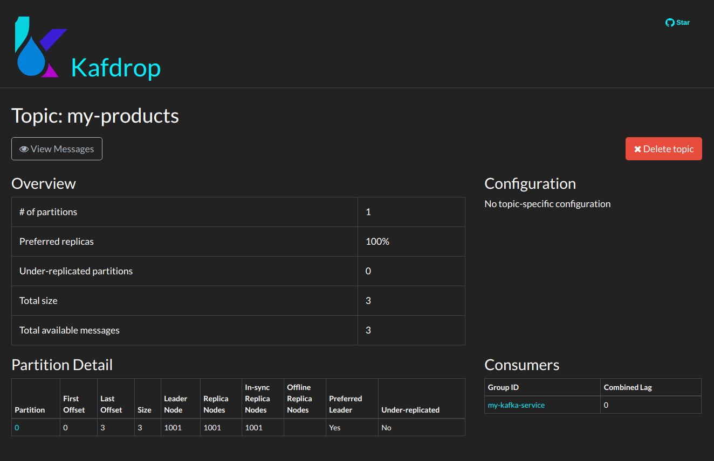

# Kafka Sample Environment

## Pre-requisites to run
- Docker
- Docker-compose
- Java 8+
- Gradle

# Running the Kafka Server

Just edit `docker-compose.yaml` at `KAFKA_CFG_ADVERTISED_LISTENERS`, edit `192.168.0.3` to represent your local IP Address. This is necessary because since we're running Kafka inside a container, by default, it will register itself at ZooKeeper with the Container Hostname.
You can use localhost, but then, Kafdrop won't be able to connect to it.

That being said, just run
```bash
docker-compose up -d
```

This will setup:
- ZooKeeper
- Kafka
- Kafdrop (At http://localhost:9000)

# Running the Micronaut Application

Just run the application with:
```bash
./gradlew run
```

This application consists of 3 components:
- A Kafka Producer, that will send messages to a `my-products` topic
- A Kafka Listener, that will listen to messages at `my-products` topic
- An HTTP Endpoint at http://localhost:8080/product ,to allow you to easily send messages to your topic


After the application is running, you can send messages by sending a `POST` to http://localhost:8080/product with the body:

```json
{
	"brand": "Nike",
	"name": "Future Shoes 3"
}
```

You can check in your application console, that your Kafka Listener got the record, and printed it to the console.

# Visualizing your Kafka Cluster with Kafdrop

You can access http://localhost:9000 to see all of your Kafka Cluster information (Topics, Consumers, Partitions, etc)



# Bibliographical Reference

In order to understand everything, and to create this example, the following material was used:


- “Because Coordinating Distributed Systems Is a Zoo.” ZooKeeper, zookeeper.apache.org/doc/current/index.html.
- “Introduction.” Apache Kafka, kafka.apache.org/intro.
- “Kafka Architecture.” Cloudurable AWS Cassandra, Spark and AWS Kafka Support, Cassandra Consulting, Kafka Consulting, SMACK/Lambda Architecture Consulting, SMACK/Lambda Architecture Training, Cassandra Training and AWS DevOps Services., cloudurable.com/blog/kafka-architecture/index.html.
- Kafka Listeners - Explained, rmoff.net/2018/08/02/kafka-listeners-explained/.
- Koutanov, Emil. “Kafdrop - An Open-Source Kafka Web UI.” DEV Community, DEV Community, 19 Dec. 2019, dev.to/ekoutanov/kafdrop-an-open-source-kafka-web-ui-mbn.
- Posta. “What Is Apache Kafka? Why Is It so Popular? Should I Use It?” TechBeacon, TechBeacon, 5 Feb. 2019, techbeacon.com/app-dev-testing/what-apache-kafka-why-it-so-popular-should-you-use-it.
- “Quickstart.” Apache Kafka, kafka.apache.org/quickstart.
- Shilo, Guy. “Kafka Administration and Monitoring UI Tools - DZone Big Data.” Dzone.com, 28 Nov. 2019, dzone.com/articles/kafka-administration-and-monitoring-ui-tools.
- ZooKeeper, zookeeper.apache.org/doc/current/zookeeperOver.html.
- Micronaut Kafka, micronaut-projects.github.io/micronaut-kafka/latest/guide.